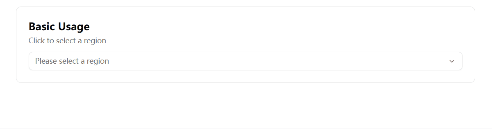

# Cascader-Shadcn-Vue

A cascading dropdown component for selecting hierarchical data such as locations, categories, or organizational structures.

**Inspired by:** [cascader-shadcn](https://github.com/Ademking/cascader-shadcn/)

## Features

- Hierarchical cascading menu
- Click or hover expansion
- Supports icons and custom labels
- Custom display rendering
- Disable per option or entire component
- Responsive design with drawer mode on mobile
- Shadcn-compatible + Tailwind-friendly
- Fully type-safe (TypeScript)



## Installation

### Manual Installation

Copy the [`Cascader.vue`](https://github.com/Hanggesimida/shadcn-vue-cascader/blob/main/src/components/ui/cascader/Cascader.vue) component from the repository into your Shadcn components directory (`src/components/ui/cascader/`).

Before using this component, make sure you have followed the necessary setup steps for shadcn-vue and installed the required dependencies:

**Using npm:**
```bash
npm install @vueuse/core lucide-vue-next
```

**Using pnpm:**
```bash
pnpm add @vueuse/core lucide-vue-next
```

Additionally, ensure you have the following shadcn-vue components installed (if not already present):
- `popover` - for desktop dropdown display
- `drawer` - for mobile drawer display

## Usage

### Example.vue

```vue
<script setup lang="ts">
import { ref } from 'vue'
import Cascader from '@/components/ui/cascader/Cascader.vue'
import type { CascaderOption } from '@/components/ui/cascader/Cascader.vue'

const options: CascaderOption[] = [
  {
    value: "usa",
    label: "USA",
    children: [
      {
        value: "new_york",
        label: "New York",
        children: [
          { value: "statue_of_liberty", label: "Statue of Liberty" },
        ],
      },
    ],
  },
]

const selectedValue = ref<string[]>([])

function handleChange(value: string[], selectedOptions: CascaderOption[]) {
  console.log(value, selectedOptions)
}
</script>

<template>
  <Cascader
    v-model="selectedValue"
    :options="options"
    placeholder="Select location"
    @change="handleChange"
  />
</template>
```

## API Reference

### CascaderOption

| Property | Type | Description |
|----------|------|-------------|
| `value` | `string` | Unique option identifier |
| `label` | `string \| any` | Display label (text or component) |
| `textLabel` | `string` | Text label for display; fallback to value |
| `disabled` | `boolean` | Whether this option is disabled |
| `children` | `CascaderOption[]` | Nested options |

### Cascader Props

| Prop | Type | Default | Description |
|------|------|---------|-------------|
| `options` | `CascaderOption[]` | — | Cascader data options (required) |
| `modelValue` | `string[]` | — | Controlled selected value |
| `placeholder` | `string` | `"Please select"` | Placeholder text |
| `disabled` | `boolean` | `false` | Disable the component |
| `allowClear` | `boolean` | `false` | Show clear button |
| `expandTrigger` | `"click" \| "hover"` | `"click"` | How nested options expand |
| `class` | `string` | — | Trigger className |

### Cascader Events

| Event | Payload | Description |
|-------|---------|-------------|
| `update:modelValue` | `(value: string[]) => void` | Emitted when the value changes (for v-model) |
| `change` | `(value: string[], options: CascaderOption[]) => void` | Triggered when selection changes |

## Author

Built With 🍪 by Weihang Li

## License

MIT
